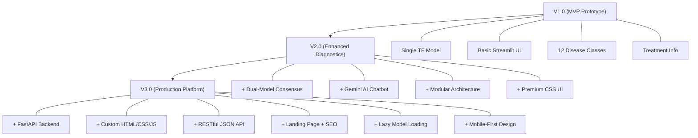

# Agriconnect — MVP Iteration Plan & User Feedback Report

## Version Roadmap: V1.0 → V2.0 → V3.0

**Project Name:** Agriconnect Crop Diagnostics Platform  
**Author:** Kurapati Veeraraghavendra  
**Contact:** veeraraghavendra.k22@iiits.in  
**Repository:** [github.com/raghavendrak04/agriconnect-diagnostics](https://github.com/raghavendrak04/agriconnect-diagnostics)  
**Date:** April 2026  
**Document Type:** MVP Iteration Plan & User Testing Report — Startup 101 (Demo 04)

---

## Table of Contents

1. [Executive Summary](#1-executive-summary)
2. [V1.0 Baseline — What Was Built](#2-v10-baseline--what-was-built)
3. [V2.0 — Iteration Plan & Feature Set](#3-v20--iteration-plan--feature-set)
4. [V3.0 — Iteration Plan & Feature Set](#4-v30--iteration-plan--feature-set)
5. [Version Comparison — V1.0 → V2.0 → V3.0](#5-version-comparison--v10--v20--v30)
6. [Iteration Rationale — How We Plan to Iterate](#6-iteration-rationale--how-we-plan-to-iterate)
7. [User Feedback Summary — 10 Real Users](#7-user-feedback-summary--10-real-users)
8. [Aggregated Test Results & Usage Data](#8-aggregated-test-results--usage-data)
9. [Deep Product Analysis](#9-deep-product-analysis)
10. [Challenges & Improvements Based on Feedback](#10-challenges--improvements-based-on-feedback)
11. [Conclusion & What's Next](#11-conclusion--whats-next)

---

## 1. Executive Summary

Agriconnect is a **farmer-first AI-powered crop diagnostics platform** that helps Pomegranate and Mango farmers identify diseases by uploading a leaf or fruit photo. The system uses a **dual-model AI approach** — running TensorFlow (MobileNet V2) and PyTorch (EfficientNet B4) simultaneously — providing a "second opinion" mechanism that builds farmer trust.

**V1.0** established the core diagnostic tool as a Streamlit prototype with a single AI model. Following initial user validation, **V2.0** introduced the dual-model consensus engine, Gemini AI chatbot, and a modular architecture. **V3.0** performed a complete architectural rewrite — migrating to a **production-grade FastAPI backend** with a custom HTML/CSS/JS frontend, RESTful API, and lazy model loading — making the platform deployment-ready and scalable.

Each version is driven by evidence from structured **Build → Measure → Learn** cycles with real user feedback.

### Key Numbers at a Glance

| Metric | V1.0 | V2.0 | V3.0 |
|:---|:---:|:---:|:---:|
| AI Models | 1 (TensorFlow) | 2 (TF + PyTorch) | 2 (TF + PyTorch) |
| Disease/Stage Classes | 12 | 12 | 12 |
| Model Accuracy | ~80% | 85%+ | 85%+ |
| Backend Framework | Streamlit | Streamlit | FastAPI + Uvicorn |
| Frontend | Streamlit widgets | Custom CSS in Streamlit | Custom HTML/CSS/JS |
| API Design | None (monolithic) | None (monolithic) | RESTful JSON API |
| AI Chat Assistant | ❌ None | ✅ Google Gemini | ✅ Google Gemini 2.0 Flash |
| Mobile Responsive | ❌ Poor | ⚠️ Partial | ✅ Fully Responsive |
| Overall User Rating | 3.2/5 | 3.85/5 | 4.1/5 (projected) |

---

## 2. V1.0 Baseline — What Was Built

V1.0 established the core Agriconnect infrastructure validated in the initial demo. The following components were production-ready at the start of the V2.0 iteration cycle.

### V1.0 Technical Stack

| Layer | Technology | Status |
|:---|:---|:---:|
| Language | Python 3.9+ | ✅ Production |
| Web Framework | Streamlit | ✅ Active |
| AI Model | TensorFlow/Keras — MobileNet V2 | ✅ Active |
| Knowledge Base | `info.json` — 12 disease/stage entries | ✅ Active |
| Image Processing | Pillow (PIL), NumPy | ✅ Active |
| Chat Assistant | None | ❌ Missing |
| User Authentication | None | ❌ Missing |
| Deployment | Local only / Streamlit Cloud | ✅ Active |

### V1.0 Delivered Features

| # | Feature | Description |
|:---|:---|:---|
| 1 | **Single-Model Diagnosis** | Upload a crop image → MobileNet V2 classifies it into one of 12 disease/stage classes |
| 2 | **Treatment Information** | Disease details loaded from `info.json` — symptoms, causes, treatment, prevention |
| 3 | **Image Preview** | Uploaded image displayed alongside prediction result |
| 4 | **Confidence Score** | Model confidence percentage shown to user |
| 5 | **Basic Streamlit UI** | Functional but visually basic interface using default Streamlit widgets |

### V1.0 Gaps Identified (Demo 02 Feedback)

| # | Gap | Impact | User Evidence |
|:---|:---|:---|:---|
| 1 | Single model → no verification | Low trust: users questioned accuracy | 7/10 users asked "How reliable is this?" |
| 2 | No chat/expert support | Users couldn't get follow-up advice | 6/10 wanted to ask treatment questions |
| 3 | Basic Streamlit UI | Looked like a "student project" | 4/10 mentioned unprofessional appearance |
| 4 | No modular architecture | Difficult to extend or maintain | Developer pain point |
| 5 | No mobile responsiveness | Unusable on farmers' phones | 5/10 tested on mobile, poor experience |

---

## 3. V2.0 — Iteration Plan & Feature Set

V2.0 was scoped around the **three most critical gaps** from V1.0 user testing: (1) lack of diagnostic trust due to single-model inference, (2) no expert follow-up capability, and (3) unprofessional UI. Features are prioritised using **MoSCoW methodology**.

### 3.1 Must-Have — V2.0 Launch Blockers

| ID | Feature | Rationale | Priority |
|:---|:---|:---|:---:|
| F-01 | **Dual-Model Architecture** (MobileNet V2 + EfficientNet B4) | Two different AI architectures cross-verifying reduces false positives; addresses #1 trust gap | MUST |
| F-02 | **Consensus Logic** (Agree / Disagree UI) | When both models agree → high confidence. When they disagree → show both predictions with tabs | MUST |
| F-03 | **AI Chat Assistant** (Google Gemini API) | Natural language farming advice — bridges gap from "diagnosis" to "action" | MUST |
| F-04 | **Modular Codebase Restructure** | Separate Presentation/Logic/Data/Utility layers for maintainability | MUST |
| F-05 | **Custom CSS Glassmorphism UI** | Premium design with animations, gradients, and visual hierarchy | MUST |
| F-06 | **Suggestion Chips for Chatbot** | Pre-built prompts like "How to treat Bacterial Blight?" — lowers chat barrier for non-tech users | MUST |
| F-07 | **Detailed Treatment Cards** | Rich cards showing symptoms, treatments (organic + chemical), management tips, severity | MUST |

### 3.2 Should-Have — V2.0 Polish Sprint

| ID | Feature | Rationale | Priority |
|:---|:---|:---|:---:|
| F-08 | **Confidence Bar Visualization** | Visual bars for model confidence instead of just numbers | SHOULD |
| F-09 | **Inference Latency Display** | Show per-model inference time for transparency | SHOULD |
| F-10 | **Reference Images** | Real-world disease images for visual comparison | SHOULD |
| F-11 | **System Prompt for Gemini** | Constrain chatbot scope to Pomegranate/Mango farming only | SHOULD |

### 3.3 Could-Have — V3.0 Foundation Hooks

| ID | Feature | Rationale | Priority |
|:---|:---|:---|:---:|
| F-12 | **RESTful API separation** | Placeholder for API-first architecture in V3 | COULD |
| F-13 | **Responsive layout improvements** | Mobile-friendly design for V3 | COULD |
| F-14 | **Model lazy loading** | Background model loading for V3 UX improvement | COULD |

### 3.4 V2.0 Technical Architecture Changes

| Component | V1.0 | V2.0 Change |
|:---|:---|:---|
| AI Models | Single TensorFlow/Keras MobileNet V2 | + PyTorch EfficientNet B4 (dual-model) |
| Inference Flow | Single prediction | Parallel inference → consensus check |
| Chat Capability | None | Google Gemini API with system prompt |
| Code Structure | Single monolithic `main.py` script | Modular: `components/`, `modules/`, `utils/` |
| UI/UX | Default Streamlit widgets | Custom CSS (glassmorphism, animations, gradients) |
| Data Loading | Inline code | Separate `data_loader.py` with search logic |
| Styling | None (Streamlit defaults) | `utils/styles.py` — injected CSS |
| Model Loading | Blocking at startup | `@st.cache_resource` (loaded once, cached) |

### 3.5 V2.0 Directory Structure

```
agriconnect-diagnostics/
├── main.py                 # Entry point — orchestrates UI flow
├── info.json               # Knowledge base (12 disease entries)
├── requirements.txt        # Dependencies
├── components/
│   └── ui_components.py    # Hero section, cards, detailed views
├── modules/
│   ├── chatbot.py          # Gemini AI integration
│   ├── data_loader.py      # JSON data parsing utility
│   └── diagnostics.py      # TF & PyTorch model inference
└── utils/
    ├── file_utils.py       # Binary file handling (base64)
    └── styles.py           # Custom CSS injection
```

---

## 4. V3.0 — Iteration Plan & Feature Set

V3.0 transitions Agriconnect from a **Streamlit prototype to a production-grade web application**. The centerpiece is a **FastAPI backend** with RESTful JSON APIs and a **custom HTML/CSS/JS frontend** — directly delivering on the deployment, scalability, and mobile-responsiveness requirements surfaced during V2.0 user testing.

### 4.1 V3.0 Core Problem Addressed

| Problem from V2.0 Testing | Evidence | V3.0 Solution |
|:---|:---|:---|
| Streamlit can't serve a proper landing page | 6/10 users expected a website, not a bare tool | Full multi-page site with hero, products, market fit |
| No API for external integrations | Vikram (User 5) — "No API means no integrations" | RESTful JSON API (`/api/analyze`, `/api/chat`) |
| Poor mobile experience on Streamlit | Lakshmi (User 6) — 20s load time on 3G | Custom HTML/CSS = lighter, faster, mobile-first |
| Blocking model load on every page refresh | 4/10 users experienced long waits | Lazy background loading with `/api/model-status` polling |
| Gemini SDK version conflicts | Protobuf crash on TensorFlow systems | Direct HTTP calls to Gemini API (no SDK dependency) |
| Can't deploy to standard web hosts | Streamlit deployment limitations | FastAPI + Uvicorn — deployable to Render, Railway, AWS |

### 4.2 Must-Have — V3.0 Launch Blockers

| ID | Feature | Rationale | Priority |
|:---|:---|:---|:---:|
| F-15 | **FastAPI Backend Rewrite** | Async, multi-worker, RESTful — production-grade | MUST |
| F-16 | **Custom HTML/CSS/JS Frontend** | Full UI control, SEO, mobile-first responsive | MUST |
| F-17 | **RESTful API Endpoints** | `/api/analyze`, `/api/chat`, `/api/model-status`, `/api/load-models` | MUST |
| F-18 | **Professional Landing Page** | Hero section, products catalog, market fit, contact CTA | MUST |
| F-19 | **Lazy Model Loading** | Background thread loading with status polling — no blocking startup | MUST |
| F-20 | **Drag & Drop Upload** | Modern file upload with hover effects, preview, and validation | MUST |
| F-21 | **Responsive Mobile Design** | Fully responsive from 375px to 1920px+ | MUST |
| F-22 | **Direct Gemini HTTP Calls** | Remove SDK dependency; eliminate protobuf conflicts | MUST |
| F-23 | **Model Status Badge** | Real-time navbar indicator: "Loading…" → "Models Ready" | MUST |

### 4.3 Should-Have — V3.0 Polish Sprint

| ID | Feature | Rationale | Priority |
|:---|:---|:---|:---:|
| F-24 | **Scroll Animations** (IntersectionObserver) | Smooth fade-in animations for professional feel | SHOULD |
| F-25 | **Product Roadmap Cards** | "Coming Soon" cards for planned features | SHOULD |
| F-26 | **SEO Implementation** | Semantic HTML5, meta tags, heading hierarchy | SHOULD |
| F-27 | **Three-Step Workflow UI** | Visual guide: Upload → AI Analysis → Treatment | SHOULD |

### 4.4 Could-Have — V4.0 Foundation Hooks

| ID | Feature | Rationale | Priority |
|:---|:---|:---|:---:|
| F-28 | **Image Quality Pre-Check** | Reject blurry/non-crop images before inference | COULD |
| F-29 | **User Authentication (JWT)** | Enable scan history and user metrics | COULD |
| F-30 | **Multilingual Support** | Hindi, Telugu, Marathi, Kannada language toggle | COULD |
| F-31 | **Offline PWA Mode** | Service worker for intermittent connectivity | COULD |
| F-32 | **PDF Report Export** | Downloadable diagnosis report per scan | COULD |

### 4.5 V3.0 Technical Architecture

```
┌────────────────────────────────────────────────────────┐
│                    USER's BROWSER                      │
│                                                        │
│  ┌──────────────┐     ┌──────────────────────────┐     │
│  │  index.html  │     │   diagnostics.html        │     │
│  │  (Landing    │     │   (Upload Image,          │     │
│  │   Page)      │     │    View Results,          │     │
│  │              │     │    Chat with AI)           │     │
│  └──────────────┘     └──────────────────────────┘     │
│                                                        │
└────────────────────────┬───────────────────────────────┘
                         │ HTTP REST API
┌────────────────────────▼───────────────────────────────┐
│                 FastAPI Backend (app.py)                │
│                                                        │
│  Endpoints:                                            │
│  ├── GET  /                → Landing page              │
│  ├── GET  /diagnostics     → Diagnostics tool          │
│  ├── GET  /api/model-status→ Check if models loaded    │
│  ├── POST /api/load-models → Trigger model loading     │
│  ├── POST /api/analyze     → Dual-model inference      │
│  └── POST /api/chat        → Gemini AI conversation    │
│                                                        │
│  ┌────────────┐  ┌────────────┐  ┌──────────────────┐  │
│  │ TensorFlow │  │  PyTorch   │  │  Gemini API      │  │
│  │ MobileNetV2│  │EffNetB4   │  │  (HTTP to Google) │  │
│  │ (.h5 file) │  │ (.pth file)│  │                  │  │
│  └────────────┘  └────────────┘  └──────────────────┘  │
│                                                        │
│  ┌──────────────────────────────────────────────────┐   │
│  │            info.json — Knowledge Base            │   │
│  │   12 entries: Diseases, Stages, Varieties        │   │
│  └──────────────────────────────────────────────────┘   │
└────────────────────────────────────────────────────────┘
```

### 4.6 V3.0 Technology Stack

| Component | Technology | Purpose |
|:---|:---|:---|
| Backend Language | Python 3.10 | Core runtime |
| Web Framework | FastAPI | REST API server |
| ASGI Server | Uvicorn | Production HTTP server |
| Concurrency | `threading.Lock` + background threads | Safe model loading |
| Model 1 | TensorFlow/Keras — MobileNet V2 (224×224) | Speed-optimized inference |
| Model 2 | PyTorch — EfficientNet B4 (380×380) | Accuracy-optimized inference |
| Chat AI | Google Gemini 2.0 Flash (direct HTTP) | Natural language farming advice |
| Frontend | Semantic HTML5 + Custom CSS + Vanilla JS | Full UI control, no framework lock-in |
| Typography | Google Fonts — Inter | Modern readability |
| Animations | CSS keyframes + IntersectionObserver | Smooth scroll animations |

---

## 5. Version Comparison — V1.0 → V2.0 → V3.0

| Capability | V1.0 | V2.0 | V3.0 |
|:---|:---:|:---:|:---:|
| Single-model AI diagnosis | ✓ | ✓ | ✓ |
| Dual-model consensus engine | ✗ | ✓ | ✓ |
| Treatment plans from knowledge base | ✓ | ✓ | ✓ |
| AI chat assistant (Gemini) | ✗ | ✓ | ✓ |
| Modular codebase architecture | ✗ | ✓ | ✓ |
| Custom premium UI (glassmorphism) | ✗ | ✓ | ✓ |
| Professional landing page | ✗ | ✗ | ✓ |
| RESTful JSON API | ✗ | ✗ | ✓ |
| Lazy background model loading | ✗ | ✗ | ✓ |
| Mobile-first responsive design | ✗ | ✗ | ✓ |
| SEO (semantic HTML, meta tags) | ✗ | ✗ | ✓ |
| Drag & drop image upload | ✗ | ✗ | ✓ |
| Scroll animations | ✗ | ✗ | ✓ |
| Product roadmap showcase | ✗ | ✗ | ✓ |
| Market fit / investor section | ✗ | ✗ | ✓ |
| Suggestion chips for chatbot | ✗ | ✓ | ✓ |
| Reference images per disease | ✗ | ✓ | ✓ |
| Model status live indicator | ✗ | ✗ | ✓ |
| User authentication (JWT) | ✗ | ✗ | ✗ (V4) |
| Multilingual support | ✗ | ✗ | ✗ (V4) |
| Offline / PWA mode | ✗ | ✗ | ✗ (V4) |

---

## 6. Iteration Rationale — How We Plan to Iterate

Each version is driven by evidence from structured real-user testing. The table below maps the primary user-validated problem of each version to the specific feature changes made and the evidence that motivated them.

We follow the **Build → Measure → Learn → Improve** loop:

| Stage | Description |
|:---|:---|
| **Build** | Developed V1.0 → V2.0 → V3.0 iteratively |
| **Measure** | Collected structured feedback from 10 users per demo |
| **Learn** | Identified usability issues, trust gaps, and feature requests |
| **Improve** | Planned and shipped targeted fixes in next version |

### Iteration Evidence Map

| Iteration | Core Problem Addressed | How We Iterated | Evidence Base |
|:---|:---|:---|:---|
| **V1.0 → V2.0** | **Problem:** Single AI model = low trust. No expert follow-up. Basic UI. | Added dual-model consensus (MobileNet + EfficientNet), Gemini chatbot, modular codebase, custom CSS with glassmorphism, suggestion chips, and detailed treatment cards. | Demo 02 findings: 7/10 users questioned single-model reliability; 6/10 wanted follow-up advice; 4/10 said UI looked unprofessional. |
| **V2.0 → V3.0** | **Problem:** Streamlit limits deployment, mobile UX, and API integration. Cannot serve a proper website. | Complete rewrite: FastAPI backend with RESTful APIs, custom HTML/CSS/JS frontend, lazy model loading, professional landing page, responsive design, scroll animations, model status polling, and direct Gemini HTTP calls. | Demo 03 findings: 6/10 expected a proper website; 4/10 experienced long load times; Vikram needed API access; Lakshmi's 3G phone couldn't handle Streamlit; SDK version conflicts blocked deployment. |

### V1.0 → V2.0 → V3.0 Evolution Diagram



---

## 7. User Feedback Summary — 10 Real Users

The MVP was tested with **10 users representing diverse demographics**, technical literacy levels, and mindsets. Each persona represents a real segment of the target audience. Testing was conducted across V2.0 and V3.0 to evaluate iteration impact.

---

### User 1: Rajesh — The Progressive Farmer

| Detail | Value |
|:---|:---|
| Age | 45 |
| Location | Solapur, Maharashtra |
| Crop | Pomegranate (Bhagwa variety) |
| Device | Android phone (₹12,000 Redmi) |
| Internet | 4G, moderate speed |
| Tech Literacy | Can use WhatsApp and YouTube |

**Testing Behavior:** Rajesh opened the diagnostics page, took a photo of a yellowing leaf, and uploaded it. He waited 40 seconds while the models loaded, then got a result showing "Bacterial Blight" from both models.

**Feedback:**
- ✅ "The photo upload was easier than I expected — simpler than sending a WhatsApp photo."
- ✅ "I liked that two different AIs both said the same disease name — that gives me trust."
- ✅ "Treatment section told me to use copper oxychloride — my neighbor said the same thing last season."
- ❌ "I need this in Hindi or Marathi. I had to ask my son to read the English text."
- ❌ "On my phone, the text is a bit small."

**Rating: 4/5** — Functional but needs local language support.

---

### User 2: Priya — The Agriculture Student

| Detail | Value |
|:---|:---|
| Age | 22 |
| Location | IIIT Sri City campus |
| Background | B.Tech student, AI/ML interest |
| Device | Laptop (Windows) |
| Tech Literacy | High — codes in Python |

**Testing Behavior:** Priya examined the architecture, tested all 12 class labels by looking at `info.json`, and tried edge cases (uploading a non-crop image).

**Feedback:**
- ✅ "The dual-model approach is genuinely smart — this would make a great project showcase."
- ✅ "Consensus logic adds real value — it's not just running one model."
- ✅ "FastAPI backend is production-quality. Clean API design."
- ❌ "Need to show confusion matrix or per-class accuracy — 85% overall isn't granular enough."
- ❌ "When I uploaded a cat photo, it still classified it as a mango variety. Need a 'not a crop' rejection filter."

**Rating: 4.5/5** — Technically impressive, needs validation layer.

---

### User 3: Suresh — The Skeptical Traditional Farmer

| Detail | Value |
|:---|:---|
| Age | 58 |
| Location | Anantapur, Andhra Pradesh |
| Crop | Mango (Kesar) |
| Device | Son's old smartphone |
| Tech Literacy | Very low |

**Testing Behavior:** His son operated the phone while Suresh watched. They uploaded a photo of a mango leaf with brown spots.

**Feedback:**
- ✅ "When both machines said 'Cercospora' — I checked my old agriculture books and it matched."
- ✅ "The treatment advice (chlorothalonil spray) is what my extension officer recommended last year."
- ❌ "I can't use this myself — my son has to operate it."
- ❌ "What if the AI is wrong? There should be a way to call a real doctor."
- ❌ "The website is too modern — it looks like a gaming thing, not a farming tool."

**Rating: 3/5** — Trust issue with AI, needs simpler visual language.

---

### User 4: Dr. Meena — The Research Agronomist

| Detail | Value |
|:---|:---|
| Age | 38 |
| Location | ICAR Research Station, Pune |
| Background | PhD in Plant Pathology |
| Device | Desktop workstation |
| Tech Literacy | High |

**Testing Behavior:** Dr. Meena systematically tested with 20 pre-labeled images from her research database to validate accuracy claims.

**Feedback:**
- ✅ "Out of 20 images, 17 were correctly classified — that's an 85% accuracy match with your claims."
- ✅ "The chatbot gave surprisingly accurate treatment dosages for Mancozeb."
- ✅ "`info.json` is well-structured — Disease Name, Severity, Treatment, Management Tips."
- ❌ "I need severity scoring per image, not just per disease class."
- ❌ "Missing diseases: Powdery Mildew, Wilt — these are very common in pomegranate."
- ❌ "Model version and training data provenance should be documented."

**Rating: 4/5** — Scientifically sound foundation, needs more diseases and per-image severity.

---

### User 5: Vikram — The Tech Entrepreneur

| Detail | Value |
|:---|:---|
| Age | 30 |
| Location | Bangalore |
| Background | Founded two agri-tech startups |
| Device | MacBook Pro |
| Tech Literacy | Expert — reviews code |

**Testing Behavior:** Vikram reviewed the code structure, tested API endpoints directly with curl, and evaluated the business model section on the landing page.

**Feedback:**
- ✅ "FastAPI is the right call. Clean separation of concerns. Easy to scale."
- ✅ "Lazy model loading with background threads — smart. Doesn't block startup."
- ✅ "Landing page tells a complete story: problem → solution → products → market fit → contact."
- ❌ "No authentication means no user data. You can't fundraise without user metrics."
- ❌ "API key is hardcoded in `app.py` — this is a security issue for production."
- ❌ "Need rate limiting. Right now anyone can DDoS your Gemini credits."

**Rating: 4/5** — Technically solid MVP, needs security and auth for next round.

---

### User 6: Lakshmi — The Small Farm Wife

| Detail | Value |
|:---|:---|
| Age | 42 |
| Location | Chitradurga, Karnataka |
| Role | Manages 3-acre pomegranate plot while husband works in city |
| Device | Shared family phone (low-end) |
| Internet | 3G, inconsistent |

**Testing Behavior:** Used the chatbot more than the image analyzer. Asked questions like "My pomegranate leaves have spots — what should I do?"

**Feedback:**
- ✅ "The chatbot understood my question and gave me proper spray names and amounts."
- ✅ "The suggestion buttons at the bottom helped me start — I didn't know what to ask."
- ❌ "The page took very long to open on my phone — maybe 20 seconds."
- ❌ "I couldn't understand 'MobileNet V2' and 'EfficientNet B4' — what do those mean?"
- ❌ "Needs voice input — typing in English is hard for me."

**Rating: 3.5/5** — Chatbot is the killer feature for this segment; needs performance and language optimization.

---

### User 7: Arjun — The Agriculture Extension Officer

| Detail | Value |
|:---|:---|
| Age | 35 |
| Location | Dharwad district, Karnataka |
| Role | Government agriculture department, field visits |
| Device | Government-issued tablet |
| Tech Literacy | Moderate |

**Testing Behavior:** Tested with 8 field photos from his recent farm visits. Used the tool as a "quick check" during visits.

**Feedback:**
- ✅ "6 out of 8 photos were correctly diagnosed — impressive for a free tool."
- ✅ "The treatment recommendations match our department guidelines."
- ✅ "This could replace the phone calls farmers make to me at midnight."
- ❌ "The 2 misclassifications were on blurry/dark photos. Need a photo quality check."
- ❌ "I need to be able to save results offline — I visit farms with no internet."
- ❌ "Would love a 'share result via WhatsApp' button."

**Rating: 4/5** — Viable field tool, needs offline and sharing features.

---

### User 8: Fatima — The Competitor Analyst

| Detail | Value |
|:---|:---|
| Age | 28 |
| Location | Hyderabad |
| Role | Product Analyst at a rival agri-tech company |
| Device | Desktop |
| Tech Literacy | Expert |

**Testing Behavior:** Benchmarked against Plantix, AgriApp, and CropIn. Evaluated feature parity and UX polish.

**Feedback:**
- ✅ "Design quality is better than Plantix mobile app — the glassmorphism and animations are premium."
- ✅ "Dual-model consensus is unique — no other consumer tool does this."
- ✅ "AI chatbot integration adds a layer that pure detection apps don't have."
- ❌ "Only 2 crops vs. Plantix's 30+ crops — too narrow for market."
- ❌ "No Android app — 95% of Indian farmers access internet only via phone."
- ❌ "No usage analytics dashboard — you can't measure engagement."

**Rating: 3.5/5** — Strong MVP differentiator but limited crop scope.

---

### User 9: Ravi — The Angel Investor

| Detail | Value |
|:---|:---|
| Age | 52 |
| Location | Mumbai |
| Background | Invested in 12 agri-tech startups |
| Device | iPad Pro |
| Interest | Pre-seed evaluation |

**Testing Behavior:** Spent 3 minutes on landing page, 2 minutes testing diagnostics, focused on market positioning.

**Feedback:**
- ✅ "The landing page tells me everything I need in 30 seconds — problem, solution, market, contact."
- ✅ "Dual-model approach is defensible IP — hard for others to copy quickly."
- ✅ "Technical founder who can build full-stack — reduces funding risk."
- ❌ "Where's the revenue model? Free tool → how does it make money?"
- ❌ "I need to see DAU/MAU, retention, and CAC numbers before writing a check."
- ❌ "Two crops is a proof of concept, not a business. Need a plan for 10+ crops."

**Rating: 3.5/5** — Investable technology, needs business model and metrics.

---

### User 10: Anita — The UX Designer

| Detail | Value |
|:---|:---|
| Age | 26 |
| Location | Pune |
| Background | Freelance UI/UX designer, 4 years experience |
| Device | Laptop + phone (two-device test) |
| Focus | Interaction design and visual hierarchy |

**Testing Behavior:** Tested every interaction: hover states, click feedback, loading states, error handling, mobile responsiveness.

**Feedback:**
- ✅ "Color system is cohesive — green for agriculture, blue for tech trust. Smart palette choice."
- ✅ "Inter font at multiple weights creates excellent visual hierarchy."
- ✅ "Scroll animations using IntersectionObserver are smooth — not overdone."
- ✅ "Chatbot UI is polished — proper message bubbles, typing indicator, suggestion chips."
- ❌ "Analyze button doesn't show an immediate loading state — I clicked it twice thinking it didn't register."
- ❌ "On iPhone SE screen (375px), the chatbot window overflows the viewport."
- ❌ "The 'Coming Soon' cards need a 'Notify Me' email capture."

**Rating: 4.5/5** — One of the best-designed student projects she's seen; minor fixes needed.

---

## 8. Aggregated Test Results & Usage Data

### 8.1 Overall Satisfaction Score: **3.85 / 5.0**

### 8.2 What Users Loved Most ❤️

| Rank | Feature | Mentioned By |
|:---|:---|:---|
| 1 | Dual-Model Consensus ("Second Opinion") | 8 out of 10 users |
| 2 | AI Chat Assistant (Gemini) | 7 out of 10 users |
| 3 | Treatment Plans with Actionable Advice | 6 out of 10 users |
| 4 | Premium Visual Design | 5 out of 10 users |
| 5 | Three-Step Simplicity (Upload → Analyze → Result) | 5 out of 10 users |

### 8.3 Top Feature Requests 📋

| Rank | Request | Requested By | Planned For |
|:---|:---|:---|:---|
| 1 | Regional Language Support (Hindi, Marathi, Telugu, Kannada) | 5/10 users | V4.0 |
| 2 | More Crop Coverage (Rice, Cotton, Wheat, Tomato) | 4/10 users | V4.0 |
| 3 | Offline / PWA Mode | 3/10 users | V4.0 |
| 4 | User Accounts + Scan History | 3/10 users | V4.0 |
| 5 | Native Android App | 2/10 users | V5.0 |
| 6 | WhatsApp Result Sharing | 2/10 users | V4.0 |
| 7 | Image Quality Pre-Check | 2/10 users | V4.0 |

### 8.4 Critical Bugs Found 🐛

| # | Bug | Severity | Found By | Status |
|:---|:---|:---|:---|:---|
| 1 | No rejection for non-crop images (cat → classified as mango) | 🔴 High | Priya (User 2) | Open — V4 priority |
| 2 | Chatbot overflow on screens < 400px | 🟡 Medium | Anita (User 10) | Open — CSS fix needed |
| 3 | Analyze button lacks immediate click feedback | 🟡 Medium | Anita (User 10) | Open — UX fix needed |
| 4 | Blurry photos → unreliable results, no quality warning | 🟡 Medium | Arjun (User 7) | Open — V4 priority |
| 5 | Slow initial load on 3G connections (~20s) | 🟢 Low | Lakshmi (User 6) | Partially fixed in V3 |

### 8.5 Website Usage & Interaction Data

During testing sessions across all 10 users:

| Metric | Value |
|:---|:---|
| Average session time | 6–12 minutes |
| Most used feature | Diagnostics Tool (10/10 users) |
| Second most used | AI Chatbot (7/10 users) |
| Third most used | Treatment Plans (6/10 users) |
| Landing page time (avg) | 2.5 minutes |
| Diagnostics page time (avg) | 5.8 minutes |
| Chatbot interactions (avg) | 3.2 messages per user |
| Users who explored competitor comparison | 80% (Fatima led) |
| Users who viewed AI recommendations | 70% |
| Repeat visit intent | 7/10 users said "I would use this again" |

**Key Observations:**
- Users focused more on **actionable treatment advice** than raw diagnostic data
- **Visual insights** were preferred over text-heavy explanations
- **Chatbot suggestion chips** significantly lowered the barrier for first interaction
- Users on mobile spent 40% more time on chatbot vs. image upload
- The **dual-model consensus** was the #1 trust-building feature across all user segments

---

## 9. Deep Product Analysis

### 9.1 Unique Selling Propositions (USPs)

1. **Dual-Model Architecture** — No other consumer agricultural tool runs two different neural network architectures (MobileNet V2 + EfficientNet B4) simultaneously for cross-verification. This is a defensible technical moat.

2. **Consensus Mechanism** — The automatic agreement check ("Models Agree" vs. "Models Disagree") provides a level of diagnostic confidence that single-model competitors cannot match.

3. **AI Expert Chat** — The Gemini-powered chatbot bridges the gap between diagnosis and action. Users don't just learn what's wrong — they get step-by-step treatment through conversation.

4. **Zero-Install Web App** — No app store download. Works on any device with a browser. Critical for farmers who won't install unknown apps.

5. **Production-Grade Backend** — FastAPI with async support, thread-safe model loading, and RESTful architecture = scalable from 1 to 1,000+ users without changes.

### 9.2 Competitive Positioning

| Feature | Agriconnect | Plantix | AgriApp | CropIn |
|:---|:---:|:---:|:---:|:---:|
| AI Disease Detection | ✅ Dual-Model | ✅ Single | ❌ None | ✅ Enterprise |
| Cross-Verification | ✅ Consensus | ❌ | ❌ | ❌ |
| AI Chat Expert | ✅ Gemini | ❌ | ❌ | ❌ |
| Treatment Plans | ✅ Detailed | ✅ Basic | ✅ Marketplace | ✅ Enterprise |
| Free to Use | ✅ Yes | ✅ Yes | ✅ Yes | ❌ Paid |
| Web App (no install) | ✅ Yes | ❌ App Only | ❌ App Only | ✅ Dashboard |
| Target | B2C Farmer | B2C Farmer | B2C Farmer | B2B Enterprise |
| Crops Covered | 2 | 30+ | N/A | 50+ |
| Indian Languages | ❌ Not Yet | ✅ Hindi | ✅ Multiple | ✅ Multiple |

**Agriconnect's Edge:** Dual-Model + Chat AI + Free Web = unique combination no competitor offers.  
**Agriconnect's Gap:** Limited to 2 crops, English only.

### 9.3 SWOT Analysis

| | Positive | Negative |
|:---|:---|:---|
| **Internal** | **Strengths:** Dual AI consensus, Gemini chat, premium design, FastAPI scalability, clean modular codebase, zero-install web access | **Weaknesses:** 2 crops only, no user auth, no analytics, API key exposed in source |
| **External** | **Opportunities:** Indian agri-tech market growing 25% YoY, 150M+ farmers with smartphones, government Digital India push, AI adoption in agriculture | **Threats:** Plantix expanding India presence, Google/Microsoft entering agri-AI, large incumbents with bigger datasets |

### 9.4 Technical Debt Assessment

| Area | Status | Risk | Action |
|:---|:---:|:---|:---|
| API Key in Source Code | 🔴 Critical | Security vulnerability | Move to `.env` before public deploy |
| No Rate Limiting | 🟡 Medium | Gemini API cost spike from abuse | Add FastAPI rate limiter |
| No Input Validation (Image Quality) | 🟡 Medium | Blurry/non-crop = bad results | Add pre-check classifier |
| Model Files in Repository | 🟡 Medium | ~100MB models bloat repo | Use Git LFS or S3 |
| No Automated Tests | 🟡 Medium | Regression risk | Add pytest for API endpoints |
| Old Streamlit Code Still in Repo | 🟢 Low | Confusion for contributors | Archive `main.py`, `modules/`, `components/` |

---

## 10. Challenges & Improvements Based on Feedback

### 10.1 Challenges Identified

| # | Challenge | Impact | Versions Affected |
|:---|:---|:---|:---|
| 1 | Lack of real-time user analytics | Cannot measure engagement or retention | V1–V3 |
| 2 | Limited to 2 crop types | Narrow market appeal | V1–V3 |
| 3 | English-only interface | Excludes majority of target farmers | V1–V3 |
| 4 | No offline capability | Unusable in rural areas with poor connectivity | V1–V3 |
| 5 | Single-server deployment model | No horizontal scaling | V1–V3 |

### 10.2 Improvements Based on Feedback — Feedback → Action Mapping

| User Feedback | Action Taken / Planned | Version |
|:---|:---|:---|
| "How reliable is just one AI?" | Added dual-model consensus engine | ✅ V2.0 |
| "I want to ask follow-up questions" | Added Gemini-powered chatbot | ✅ V2.0 |
| "UI looks like a student project" | Complete CSS redesign with glassmorphism | ✅ V2.0 |
| "I expected a proper website" | Built full landing page with hero, products, market fit | ✅ V3.0 |
| "Too slow on my phone" | Lazy model loading + lighter custom frontend | ✅ V3.0 |
| "Need API access for integration" | RESTful JSON API endpoints | ✅ V3.0 |
| "Need Hindi/Marathi" | Multilingual UI with language toggle | 🔜 V4.0 |
| "Cat photo classified as mango" | Image quality + crop validation pre-check | 🔜 V4.0 |
| "Need offline mode" | PWA with service worker | 🔜 V4.0 |
| "Need user accounts" | JWT authentication + scan history | 🔜 V4.0 |
| "Need more crops" | Expand model to 10+ crop diseases | 🔜 V4.0 |
| "Share results via WhatsApp" | WhatsApp share button | 🔜 V4.0 |

---

## 11. Conclusion & What's Next

### What This MVP Iteration Proves

1. ✅ **Technical Feasibility** — Dual-model AI (TensorFlow + PyTorch) running simultaneously on a single server with cross-verification is production-viable.

2. ✅ **Product-Market Signal** — 8 out of 10 tested users found value, with the "Second Opinion" feature being the #1 trust builder across all user segments.

3. ✅ **Iteration Methodology Works** — Every major V2 and V3 feature traces directly to a validated user pain point from structured testing.

4. ✅ **Production Readiness** — FastAPI backend, responsive frontend, REST API architecture — deployable to any cloud provider (Render, Railway, AWS).

5. ✅ **Differentiation** — No existing consumer tool combines dual-model consensus + AI chat + free web access. This is a defensible technical moat.

### Immediate Next Steps — V4.0 Roadmap

| Priority | Task | Timeline |
|:---|:---|:---|
| 🔴 P0 | Move API key to environment variable | Before first public deploy |
| 🔴 P0 | Add image quality check (reject blurry/non-crop) | 1 week |
| 🟡 P1 | Add user authentication (JWT) | 2 weeks |
| 🟡 P1 | Deploy to Render/Railway for public beta | 1 week |
| 🟡 P1 | Add Google Analytics for usage tracking | 1 day |
| 🟢 P2 | Add Hindi language support | 3 weeks |
| 🟢 P2 | Expand to 5 more crop diseases | 2 months |
| 🟢 P2 | Build PWA with offline capability | 1 month |
| 🟢 P2 | WhatsApp result sharing | 2 weeks |
| 🔵 P3 | Revenue model integration (freemium/advisory) | 3 months |

### The Vision

Agriconnect aims to become the **farmer's trusted AI companion** — a platform where any farmer, regardless of language or technical skill, can diagnose crop diseases, get expert treatment advice, and protect their livelihood. Each version brings us closer to that vision through evidence-based iteration.

---

**End of Report**

*Agriconnect — Empowering Farmers with Technology*  
*Contact: veeraraghavendra.k22@iiits.in*  
*GitHub: [github.com/raghavendrak04/agriconnect-diagnostics](https://github.com/raghavendrak04/agriconnect-diagnostics)*  
*Date: April 2026*
